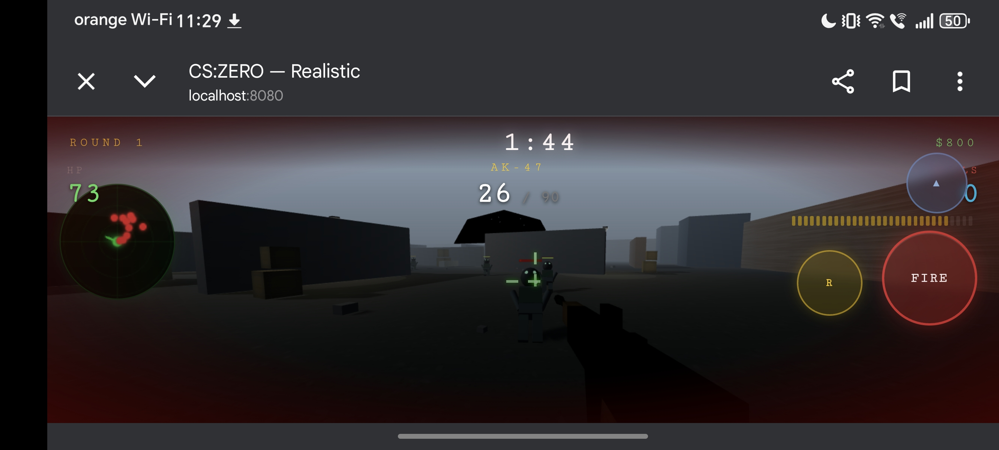
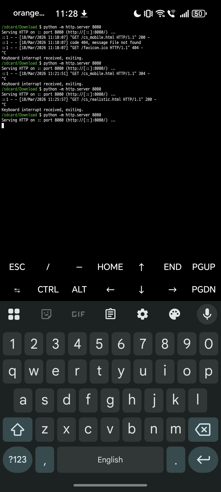

# 🎮 CS:ZERO — Browser FPS for Termux

<div align="center">



**A fully playable 3D Counter-Strike inspired FPS that runs directly in your Android browser via Termux.**  
Built with Three.js — no app store, no install, no root required.

[](https://buymeacoffee.com/flandreiii)


</div>

---

## 📸 Screenshots

| Termux Setup | In-Game |
|:---:|:---:|
|  |  |
| *Python HTTP server running on port 8080* | *Round 1 — engaging enemies with AK-47* |

---

## ✨ Features

- **Full 3D environment** — Night map with fog, shadows, street lamps, and distant city skyline
- **Realistic AK-47 viewmodel** — Detailed gun model with recoil, muzzle flash, and reload animation
- **AI Enemies** — Tactical soldiers with helmets, patrol/chase behavior, animated legs, and HP bars
- **Procedural textures** — Brick, concrete, asphalt, wood grain, and metal — zero image files needed
- **ACES Filmic tonemapping** — Cinematic rendering pipeline via Three.js physically-correct lights
- **Bullet holes & sparks** — Decals that stick to walls, spark particles on impact
- **Full mobile HUD** — Radar, ammo shell indicators, kill feed, round timer, and money counter
- **Touch controls** — Dynamic joystick (left thumb to move) + look zone (right thumb to aim)

---

## 🚀 Quick Start (Termux)

### 1. Install Termux
Download **Termux** from [F-Droid](https://f-droid.org/packages/com.termux/) (recommended over Play Store).

### 2. Install Python
```bash
pkg update && pkg install python
```

### 3. Download the game
```bash
# Option A — download directly
curl -O https://your-link-here/cs_realistic.html

# Option B — if you already have the file in /sdcard/Download
cd /sdcard/Download
```

### 4. Start the server
```bash
python -m http.server 8080
```

### 5. Open in browser
Open your Android browser and go to:
```
http://localhost:8080/cs_realistic.html
```

> Tap **DEPLOY** and start playing!

---

## 🎮 Controls

| Control | Action |
|---------|--------|
| **Left thumb drag** | Move (joystick appears where you touch) |
| **Right thumb drag** | Look around / aim |
| **FIRE button** | Shoot |
| **R button** | Reload |
| **▲ button** | Jump |

---

## 📁 Project Structure

```
cs_realistic.html    ← Single-file game (everything included)
README.md            ← This file
termux_screenshot.jpg
gameplay_screenshot.jpg
```

Everything is bundled into **one single HTML file** — no dependencies to install, no build step.

---

## 🛠️ Tech Stack

| Component | Technology |
|-----------|-----------|
| 3D Rendering | Three.js r128 |
| Lighting | PBR + ACES Filmic Tonemapping |
| Textures | Procedural Canvas2D generation |
| Physics | Custom AABB collision |
| Controls | Touch Events API |
| Server | Python `http.server` |

---

## ☕ Support the Project

If you enjoy this project and want to support more work like it, consider buying me a coffee!

<div align="center">

[](https://buymeacoffee.com/flandreiii)

**[buymeacoffee.com/flandreiii](https://buymeacoffee.com/flandreiii)**

</div>

Every coffee helps me spend more time building cool projects like this. Thank you! 🙏

---

## 📄 License

MIT License — free to use, modify, and share.

---

<div align="center">

Made with ❤️ for the Termux community

`#termux` `#games` `#cs` `#counterstrike` `#android` `#threejs` `#fps` `#mobilegaming` `#termuxgames` `#browserGame` `#javascript` `#openSource`

</div>
